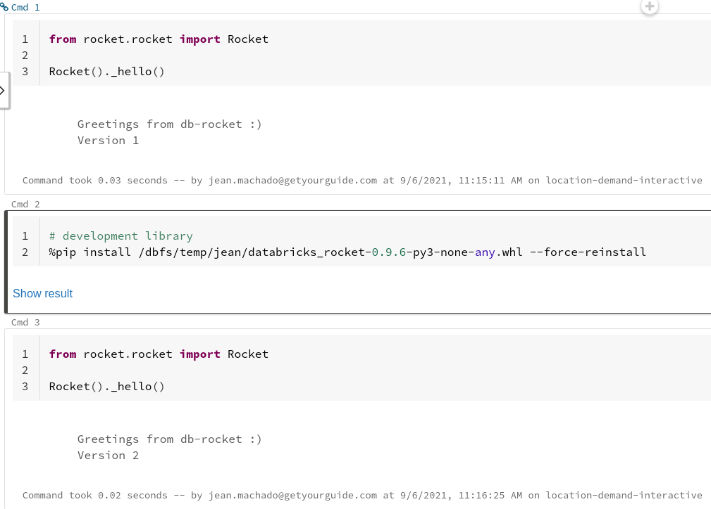

## DB-Rocket


[](https://badge.fury.io/py/databricks-rocket)


Keep your local python scripts installed and in sync with a databricks notebook.
Every change on your local machine is automatically applied to the notebook.
Shortens the feedback loop to develop git based projects.
Removes the need to setup a local development environment.

## Installation

```sh
pip3 install databricks-rocket
```

Please sure your python interpreter is 3.7 or higher.

## Setup

Make sure you have a databricks token exported in your environment.

```sh
export DATABRICKS_TOKEN="mydatabrickstoken"
```

If your project is not a pip package already you have to turn it into one. You can use dbrocket to do that.

```sh
dbrocket setup
```

Will create a setup.py for you.

## Using db-rocket

```sh
dbrocket launch
```

The command returns the exact command you have to perform in your notebook next.

Example:

```sh
We are now building your Python repo as a library...
Done! in your notebook install the library by running:

%pip install --upgrade pip
%pip install /dbfs/temp/username/databricks_rocket-1.1.3-py3-none-any.whl --force-reinstall
```


Create a cell in a notebook and paste the content (example below).



## Support

- Databricks: >=7
- Python: >=3.7
- Tested on Platform: Linux, MacOs. Windows will probably not work but contributions are welcomed!

## Acknowledgments

- Thanks Leon Poli for the Logo :)
- Thanks Stephane Leonard for source-code and documentation improvements :)
- Thanks Malachi Soord for the CICD setup and README improvements

Contributions are welcomed!

# Security

For security issues please contact [security@getyourguide.com](mailto:security@getyourguide.com).

# Legal

db-rocket is licensed under the Apache License, Version 2.0. See [LICENSE](LICENSE.txt) for the full text.
